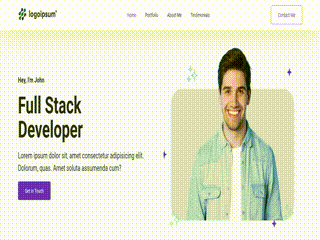

<div align="center">
  
  
  <br />
  <h2 align="center">Personal Portfolio Website</h2>

  Responsive personal portfolio website, <br />Responsive for all devices, build using HTML, CSS, and React JS.

</div>

<br />

### Demo Screeshots



### Prerequisites

Before you begin, ensure you have met the following requirements:

* Make sure you have nodejs and npm installed. [node.js](https://nodejs.org/en/)
* Code Editor : Visual Studio Code

## Run Locally

### Download this Repo

Download .zip and extract to your own folder work from.

### Clone your Fork

You should always work directly from your forked copy.

```bash
git clone git@github.com:username/react-js-personal-portfolio.git
cd react-js-personal-portfolio
```

## Open the project in vscode

## Available Scripts

In the project directory, you can run:

### `npm install`

Install the dependencies to the local node_modules folder.

### `npm start`

Runs the app in the development mode.\
Open [http://localhost:3000](http://localhost:3000) to view it in your browser.

The page will reload when you make changes.\
You may also see any lint errors in the console.

### `npm run build`

Builds the app for production to the `build` folder.\
It correctly bundles React in production mode and optimizes the build for the best performance.

The build is minified and the filenames include the hashes.\
Your app is ready to be deployed!

See the section about [deployment](https://facebook.github.io/create-react-app/docs/deployment) for more information.
